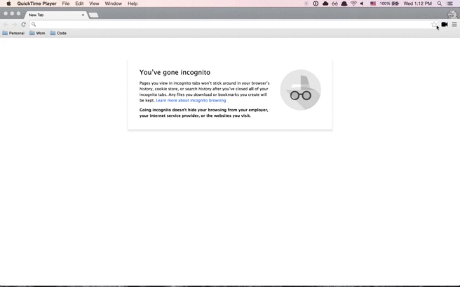

# Daydream

A chrome extension that records your activity and generates a [nightmare](https://github.com/segmentio/nightmare) script.

## Notes

For the extension to work properly:

* When you change the URL from the address bar, you need to type `daydream`, press `tab`, and then type in the url

* When you type input elements, you need to press `tab` afterwards.
