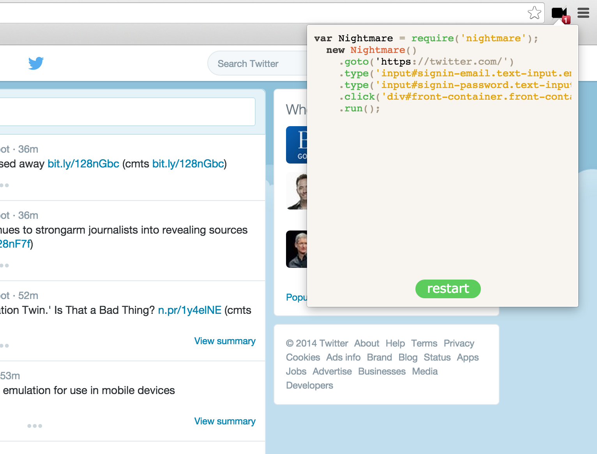

# Daydream

> A chrome extension to record your actions into a [nightmare](https://github.com/segmentio/nightmare) script.

## Example

[](http://cl.ly/0V000I2h1z2b/screenshot.png)

## Usage

### Installing

You can download Daydream from the Chrome Web Store [here](https://chrome.google.com/webstore/detail/daydream/oajnmbophdhdobfpalhkfgahchpcoali).

### Developing

1. Run ```$ git clone https://github.com/segmentio/daydream.git && cd daydream && make```
2. Navigate to `chrome://extensions`
3. Click `Pack extension...`
4. Browse to `daydream/build`
5. Click `Load unpacked extension...`
6. Browse to `daydream/build` and press `Select`

### Notes

Daydream currently supports `.goto()`, `.click()`, `.type()`, `.screenshot()`, and `.refresh()`.

If you want daydream to capture typing, press `tab` after you finish typing in each input element.

## Analytics

You can easily add analytics-node to your own chrome extension. Here are the steps to do that:

1. Add the following two lines to any file you want to use analytics in:

```js
var Analytics = require('analytics-node');
var analytics = new Analytics('YOUR_WRITE_KEY');
```

2. Send any Segment API calls you want, for example:

```js
analytics.identify({
  userId: '12345',
  version: chrome.app.getDetails().version,
  languages: window.navigator.languages
});

analytics.track({
  userId: '12345',
  event: 'Opened Popup'
});
```

3) [Duo](https://github.com/duojs/duo)-ify or [Browser](https://github.com/substack/node-browserify/)-ify those files.

## License

MIT