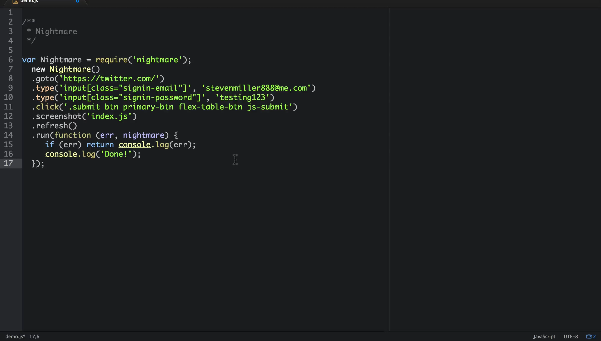

# Daydream

> A chrome extension to record your actions into a [nightmare](https://github.com/segmentio/nightmare) script.

## Demo

[](http://cl.ly/0V000I2h1z2b/Demo.mp4)

## Structure

The app is organized into two sections, *background* and *foreground*. Scripts running in the background do **not** run in the context of the page, but have access to Chrome Extension API methods for various things like injecting scripts and listening for interactions with the extension itself. Scripts running in the foreground run in the context of the page, and therefore can access the DOM, but **cannot** access certain Chrome Extension API methods that the background script can access. There is also an underlying connection between the background scripts and foreground scripts via messages.

## Usage

### Installing

You can download Daydream from the Chrome Web Store [here](https://chrome.google.com/webstore/detail/daydream/oajnmbophdhdobfpalhkfgahchpcoali).

### Developing

1. Run ```$ git clone https://github.com/segmentio/daydream.git && cd daydream && make```

2. Navigate to `chrome://extensions`

3. Click `Pack extension...`

4. Browse to `daydream/build`

5. Click `Load unpacked extension...`

6. Browse to `daydream/build` and press `Select`

### Notes

Daydream currently supports `.goto()`, `.click()`, `.type()`, `.screenshot()`, and `.refresh()`. We're looking to add support for `.forward()` and `.back()` in the near future.

If you want daydream to capture the values in input elements, press `tab` after you finish typing in each element.

## License (MIT)

```
WWWWWW||WWWWWW
 W W W||W W W
      ||
    ( OO )__________
     /  |           \
    /o o|    MIT     \
    \___/||_||__||_|| *
         || ||  || ||
        _||_|| _||_||
       (__|__|(__|__|
```

Copyright (c) 2014 Segment.io Inc. <friends@segment.com>

Permission is hereby granted, free of charge, to any person obtaining a copy of this software and associated documentation files (the 'Software'), to deal in the Software without restriction, including without limitation the rights to use, copy, modify, merge, publish, distribute, sublicense, and/or sell copies of the Software, and to permit persons to whom the Software is furnished to do so, subject to the following conditions:

The above copyright notice and this permission notice shall be included in all copies or substantial portions of the Software.

THE SOFTWARE IS PROVIDED 'AS IS', WITHOUT WARRANTY OF ANY KIND, EXPRESS OR IMPLIED, INCLUDING BUT NOT LIMITED TO THE WARRANTIES OF MERCHANTABILITY, FITNESS FOR A PARTICULAR PURPOSE AND NONINFRINGEMENT. IN NO EVENT SHALL THE AUTHORS OR COPYRIGHT HOLDERS BE LIABLE FOR ANY CLAIM, DAMAGES OR OTHER LIABILITY, WHETHER IN AN ACTION OF CONTRACT, TORT OR OTHERWISE, ARISING FROM, OUT OF OR IN CONNECTION WITH THE SOFTWARE OR THE USE OR OTHER DEALINGS IN THE SOFTWARE.
